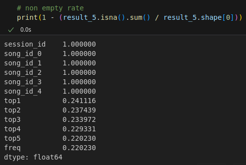

# Kaggle競賽(Top3%, 5/176)-KKCompany Music Challenge: Next-5 Songcraft
KKBOX於2023年10月在Kaggle上舉辦的比賽[KKCompany Music Challenge: Next-5 Songcraft](https://www.kaggle.com/competitions/datagame-2023)，預測用戶在同一個聆聽 session 內聆聽一定數量歌曲後，接下來可能會聆聽哪些歌曲。這將有助於打造更個性化的音樂推薦服務，提高用戶滿意度。我們特別強調參賽者需要謹慎避免過度集中於熱門音樂，以確保推薦結果更多元化，滿足不同用戶的需求。期待參賽者的創新方法，以改進音樂串流體驗，提高用戶滿意度。透過多次的探索性分析(exploratory data analysis)，分析與結果關聯性最大的特徵，並使用N-Gram方式，來進行模型訓練，最終達到比賽中的Top3%, 5/176。

<div style="display: flex; justify-content: space-between;">
    
    
</div>
Readme會分為兩部份: EDA & Method

## EDA(exploratory data analysis)
首先我們觀察了KKBOX提供的資料，分析資料完整性，看是否有不乾淨的資料。得到以下觀察：
1. Train_Source中song_id miss rate = 0%
2. 每個session都有提供20首song_id
3. Language欄位 miss rate:38.33% 
4. Train_Source中song_id是unique的比例：5.68%, 表示大部分的歌曲id,重複比例很高。用戶聆聽習慣是聆聽熟悉的歌曲。
5. play_duration參數中發現一些特徵，譬如說25%的時間是低於3s，平均值是2814s但中位數時間卻只有60s。所以說可能可以將3s當作使用者不喜愛這首歌的Treshold, 也發現到一些極大值的播放時間是需要處理的，顯然平均值是2814s相當於47分鐘是不太可能的，有可能是Podcast的時間拉長了平均值。這也是個重要特徵，譬如說先用Threshold切出podcast和歌曲再各別讓模型學習，簡單的任務模型比較容易學習到精隨。
<div style="display: flex; justify-content: space-between;">
    
    
</div>
整體上來說，KKBOX提供的資料在song_id上是比較完全的，並不需要自己填充song_id。比較困難的是如何將play_duration, artist等其他特徵結合起來。

---
### 分析特徵
一、用戶播放音樂的來源，online-downloaded, online-streaming, offline-downloaded比例幾乎一致並沒有特別的趨勢。  <br>
二、用戶聽的語言，主要分佈是Mandarin(3)>English(62)=Japanese(17)>Korean(31)>Cantonese(52)>>Hokkien(24)，但沒有特別明顯的趨勢。但這張圖可以發現如果要喂給用戶隨機資料，可以朝中英日文著手
<div style="display: flex; justify-content: space-between;">
    
    
</div>
三、用戶的登入方式，顯然手機(7)還是最大宗，不是特別意外  <br>
四、用戶聆聽的曲風，Pop> Japanese > Western > Mandarin > Rock/Alternative > Electronic/Dance > Hip-Hop/Rap
<div style="display: flex; justify-content: space-between;">
    
    
</div>
五、畫出這些參數的heatmap觀察彼此的關聯性，關聯性太高的可以去掉（資料太多,ram不夠塞)。在heatmap上語言和曲風有比較高的相似度，因為語言的missrate比較少且沒有多對一所以二者中捨去曲風當作特徵  <br>
六、使用RandomForestClassifier觀察Kaggle提供的特徵資料與第21首歌的關聯性，發現到影響力最大的變數還是song_id,尤其是後5首(第16~20)。再來是artist_id。
<div style="display: flex; justify-content: space-between;">
    
    
</div>

---
結論：
整體來說KKBOX提供的資料特徵很多，但實用的並不多。譬如說play_duration和artist理論上這兩個特徵應該對用戶有很大的影響力，但在RandomForestClassifier得到的結果卻是不如sond_id1~20，且有段的落差。<br>
就我們的猜想，play_duration和artist是有一定的影響力，關鍵在於資料中的單位是session_id，而不是用戶。每個用戶累積到的session資訊無法被保存下來，讓模型能夠紀錄和猜測的能力大幅下降。所以我們目標從原本的猜測用戶喜歡的歌變成盡量找到song_id出現的規律。<br>

這方法也就是我們最後方向，N-Gram Model。找出聽了前n首歌後下一首出現機率最高的歌。

## Method-N-Gram Model 
使用Ngram的方式是我們最終達到最佳解的方式。KNN, Randomforest, Word2Vector, Item2Vector, Transformer方式收斂狀況都不盡理想，最好的結果是word2vec(預測第21首，22~25填我們已知的最佳結果)但僅為0.11。而Ngram效果卻出乎意料的好，原因可能是使用Ngram幫我免去了從巨大資料集(Meta_song)中找到700k分之一的可能性。且發現特定資料上配對的頻率比想像的高，因此我們主要的得分方向便在於此。用提供資料中的1-20首的後幾首歌預測多首歌。

在實際上操作上，我們是先建立一個Frequency Table，找出所有n生成m的組合，像是5生成5, 5生成4, 4生成3等等。並產生出對應每個組合的頻率，讓我們可以作一個篩選。
```python
# calculate ngram frequency.
def getFreq2(df, n=2, predict=1, threshold_value=0):
    # get df's n+predict numbers of song id
    df_train = getTrainData(df, n + predict - 1)

    # calculate ngram frequency
    df_freq = (
        df_train.groupby(["song_id"] + [f"next{i}_song_id" for i in range(1, n)])
        .value_counts(sort=True, normalize=True)
        .reset_index(name="freq")
    )

    # get the most frequent song_id, sort by freq
    df_freq = (
        df_freq.sort_values(
            ["song_id"] + [f"next{i}_song_id" for i in range(1, n)] + ["freq"],
            ascending=False,
        )
        .groupby(["song_id"] + [f"next{i}_song_id" for i in range(1, n)])
        .head(1)
    )

    df_freq = df_freq[df_freq["freq"] > threshold_value]
    return df_freq
```
如下圖，這是由5首歌生成5首歌的頻率表，發現很多的歌產生的頻率為100%。只要出現特定5首歌，就會產生某5首歌的結果。
<p align="left">
    
</p>


最後結果中，我們是使用多個song_id預測多個song_id。方法是5個song_id生成5個song_id, 4個song_id生成5個song_id, 3個song_id生成5個song_id，原因是我們發覺到資料中生成5首為一組的頻率異常的高。接著我們取出freq大於40%的資料，這時有31507筆資料，佔測試資料的比例為22%。其中生成答案的中位數freq是100%, 1/4位數的freq是96%。等於說這31507筆的資料有非常高的機率會是生成的排列組合，因此在這上面，我們做了比較多的嘗試。
```python
# 5gen5
n = 5
target = 5
testX = getTestX(test_source, n)
freq5_5 = getFreq2(trainX, n, target, 0.4)
result5_5 = predict2(testX, freq5_5, n, target)
result_5 = result5_5

# 4gen5
同上5gen5, 並將target改成4

# 3gen5
同上5gen5, 並將target改成3
```

<p align="left">
    
</p>

我們只取出freq>40%是因為根據我們的實驗，當頻率<40%時雖然可能增加部份正確的值，但增加的正確性並不高。相反為了增加這些預測的值，反而減少了增加Coverage的分數。舉例來說當我將threshold設為30%時分數為0.50986，40％時則為0.51035。

接著我們繼續生成多Gram。具體方法為5首生4首, 4生4首, 4首生3首, 5首生3首, 5首生2首, 5首生1首。用這樣的組合一次生成多首歌。這時候的排列組合幾乎都沒有增加太多, 多預測到的值只增加1-2%左右(從原本的22%到23%和24%)。

<p align="left">
    
</p>

這個時候已經把大部分一次生成多首歌的結果完成。於是我們複製成功模式預測top1-5,用Ngram的方式生成下一首歌。根據實驗結果，比較好的結果是5,2,1gram。我們具體的方法是用5Gram接著2Gram接著1Gram，用前5首,2首,1首歌生成下一首歌也就是top1-5。
```python
n = 5
freq5 = getFreq(trainX, n)

# cal 5 2 1 gram
testX = predict(testX, freq5, n)
testX = merge2freq(testX, freq2)
testX = merge2freq(testX, freq1)
# testX["next_song_id"].fillna(testX["song_id_4"], inplace=True)

# combine
result_5["top1"] = result_5["top1"].fillna(testX["next_song_id"])
```

這個時候top1-5首歌的預測就完成了，剩下一點點的nan比例是沒有被1Gram涵蓋到的範圍，我們就從Meta_song的song_id中產生。
但在這之前我們發現到一件事情，資料中有部份歌曲重複的比例很高，Top1-5都是聽同一首歌。可能是資料不乾淨，或是用戶重複聆聽等原因都有可能。但在規則中如果有重複的歌曲就會被刪除且不計算分數。
> KKCompany 出題的初衷，即在音樂推薦服務中增加更多元化與個性化的曲目。因此，我們計畫增加一些額外的上傳條件，以確保每位參賽者的演算法能夠產生不同的曲目：
>1. 上傳檔案中，每個 session id 的猜測 top 1、top2、top3、top4、top5 須為不同的五首歌。
> 2. 若參賽者的上傳檔案包含重複歌曲，在 Kaggle 平台上會先進行一次 dedupe 並補 dummy 值 X。
例如，session1 的答案為 A, B, C , D, E，而上傳檔案中 session1 的猜測為 A, A, A, B, C，則平台會先將答案處理成 A, B, C, X, X 後，再計算 DCG 分數，此時 DCG 分數為 1 + 0.63 + 0.5 + 0 + 0 = 2.13。


因此我們避免不被計算分數且增加分數，我們將Top1-5重複的曲目設為nan並從meta_song中隨機給予新的song_id，增加coverage。我們做了兩次刪除重複項，第一次是多首預測多首歌後，另一次是Top1-5全部預測完後。第一次刪除是因為我們發現多首歌預測多首歌時，產生了許多重複相，因此我們刪除了重複相，希望節由5,2,1Gram給予新的可能性。第二次是因為最後答案需要避免重複相，因此刪除。
```python
# 保留第一個重複值
top15 = result_5[[f"top{i+1}" for i in range(5)]]
top15 = top15.apply(lambda x: x.mask(x.duplicated(keep="first"), np.nan), axis=1)
result_5[["top1", "top2", "top3", "top4", "top5"]] = top15

# random sample meta_song song_id
def random_sample(series: pd.Series, n: int = 1):
    _ = pd.DataFrame(series)
    random_sample = _.sample(n).reset_index(drop=True)
    return random_sample[0]


# fillna with random sample
sameple_src = meta_song["song_index"].values
sample_series = random_sample(sameple_src, len(result_5))
result_5["top1"] = result_5["top1"].fillna(sample_series)

sample_series = random_sample(sameple_src, len(result_5))
result_5["top2"] = result_5["top2"].fillna(sample_series)

sample_series = random_sample(sameple_src, len(result_5))
result_5["top3"] = result_5["top3"].fillna(sample_series)

sample_series = random_sample(sameple_src, len(result_5))
result_5["top4"] = result_5["top4"].fillna(sample_series)

sample_series = random_sample(sameple_src, len(result_5))
result_5["top5"] = result_5["top5"].fillna(sample_series)
```

以上是我們最後結果的過程，獲得Top3%的成績。整體來說我們用了Ngram的方式，找到了多首歌生成多首歌時有不錯的結果，像是生成5首歌時3/4的頻率都大於90%，因此能夠肯定我們的答案。於是我們使用多生多的方式用後幾首歌生成Top1-5。接著用5gram,2gram,1gram方式輪流生成top1到5，並且針對重複相進行刪除替補為Meta_song中的隨機song_id，提昇了Coverage的成績。最後達到0.51035第五名成績。


